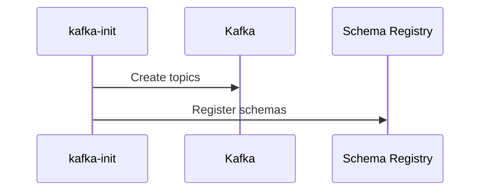
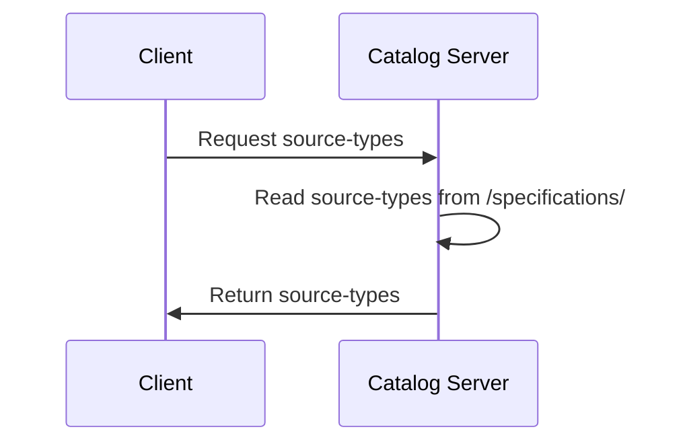

# Flow

Below are several sequence diagrams illustrating the flow of the application during startup and regular operation.

## Startup

On startup, an init container (kafka-init) will be launched to add configured topics to the Kafka schema registry.

This is done using the [docker/topic_init.sh](../../docker/topic_init.sh) script, which calls the `radar-schemas-tools` 
command line app

## Regular operation

After startup the `catalog-server` application will be running and listening for requests on public endpoints. 
This application is responsible for providing the source-types on requests, which are configured in the [specifications](../../specifications) folder.

